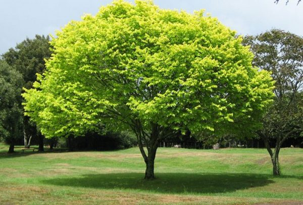

# ✏️ Pencil Sketcher

A lightweight Python tool to turn your photos into beautiful pencil-style sketches using OpenCV.  
Ideal for creative projects, filters, image editors, or just for fun!

---

## 📸 Preview

Original Image | Pencil Sketch  
:--:|:--:  
 | 

---

## 🚀 Features

- Convert any image to a **pencil sketch** with a clean and elegant effect
- Fast and lightweight — uses only OpenCV
- Easily extendable for batch processing, GUI, or web apps

---

## 🧠 How It Works

1. Convert the image to **grayscale**
2. Invert the grayscale image
3. Apply a **Gaussian blur**
4. Invert the blurred image
5. Divide the grayscale image by the inverted blur to create the sketch effect

---

## 🛠 Requirements

- Python 3.6+
- OpenCV (`cv2`)

Install with pip:

```bash
pip install opencv-python
```

---

## 🧪 Usage
Put your image in the same folder as the script and name it image.jpg
Then run:

python sketch.py

---

## 💡 Tips
Works best with clear, high-resolution images

You can adjust the blur size for sharper or softer effects:

cv2.GaussianBlur(inverted, (21, 21), 0)

---

## 📌 Future Ideas
GUI with tkinter

REST API with Flask or FastAPI

Telegram bot for image sketching

Web version with Streamlit

---

## 👤 Author
Made with 💙 by voidcompile

---

## 📜 License
MIT — Feel free to use, modify, and share!

---

## 💻 voidcompile
Stay updated with daily Python & AI projects on our channel:

📢 [github: @voidcompile](https://github.com/voidcompile)
📢 [Telegram: @voidcompile](https://t.me/voidcompile)
📢 [youtube: @voidcompile](https://www.youtube.com/@voidcompile)
📢 [email: voidcompile@gmail.com]
